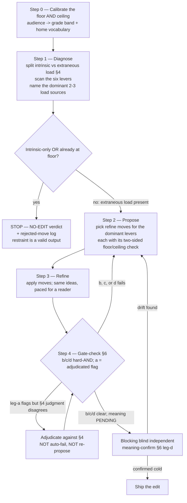

# Bamboo Readability-Editing Methodology

> A runnable **diagnose → refine** process for making any piece of writing as easy to read as its ideas allow — at the grade level the content earns, never below the floor your audience expects and never inflated above it. It fixes the real levers of reading difficulty, **not** a readability score, and wraps the process in a **gate the editor cannot game**.

*A standalone framework, published open-source by [Bamboo DCM](https://bamboodcm.com). It's the process we use internally to edit our own writing; it's written to be useful straight off the page. It pairs naturally with an editor (a human running it by hand, or a skill that applies it) and with a separate defect/AI-pattern linter that runs after — but it stands on its own.*

## What this is, in one line

A process that makes a piece **as easy to read as its ideas allow** — at a grade level the content earns, never below the floor your audience expects and never inflated above it — by naming *why* a piece is hard and fixing the real levers, not a readability score.

## What it is not

It is **not** a readability-score optimizer. Chasing a Flesch-Kincaid number produces choppy, dumbed-down prose that can read *worse* — the trap this whole methodology exists to avoid. The score is a flag that says "look here," never the thing you optimize. (See §1.)

## The stance: a process, not another rule list

Most writing guidance is a pile of *rules + examples* — keep sentences short, vary your rhythm, avoid jargon. What's usually missing is a **process**: a repeatable diagnose→refine sequence you can actually run, and a gate that proves the edit helped. This methodology is that process. It pulls the scattered rules under one cognitive frame, reframes the usual anti-AI *detection* signals as readability *refinement* moves, gives **cohesion** its own explicit lever, and wraps the whole thing in a gate the editor cannot game.

---

## 1. The governing principle — the metric-trap, and the gate it can't game

**A readability score is a diagnostic flag, never a target.** Every major formula (Flesch-Kincaid, Gunning Fog, SMOG, Coleman-Liau, ARI) is a function of two things only — word length and sentence length — and *nothing else*. None of them sees cohesion, abstraction, word order, or what the reader already knows. So you can satisfy a formula and make the text harder. The canonical proof, worth keeping in mind on every edit:

> Original: *"…the tree will heal its own wounds by growing new bark over the burned part."*
> "Improved" for the formula (shorter sentences): *"…the tree will heal its own wounds. It will grow new bark over the burned part."*

The second version scores easier and reads harder — chopping the sentence deleted the causal link ("by growing…") the reader needed. Short bought the score; the reader lost the mechanism. (Davison et al. 1980, via Bruce/Rubin/Starr 1981.)

This is not a style opinion. It is the consensus of the formula literature, *including the formulas' own defenders*: a formula validly **predicts** difficulty but is invalid the moment you **produce** to it, because writing-to-the-formula breaks the formula's own precondition ("text is honestly written") and optimizing the surface proxy doesn't move the underlying lever. The reader-expectation school says the same from the other side — Gopen & Swan reject the word-count sentence limit outright: a sentence is too long "when it has more viable candidates for stress positions than there are stress positions available," not at some magic word count.

**The corollary that governs this methodology.** If a score can't be the target, the editor needs *its own* quality bar — and that bar must be **a gate it can't game**. An editor (especially an AI one) is an optimizer, and an optimizer will happily satisfy a weak gate without doing the work. So the editor's output must clear four conditions:

> **(a) measurably easier** · **(b) not dumbed down** · **(c) on the floor** · **(d) meaning preserved.**

But the four are **not co-equal**. Three of them — (b), (c), (d) — are a hard-AND every edit must clear. The fourth, (a) "measurably easier," is a **computed flag adjudicated against judgment, not a ship-blocking veto** — because the one signal a machine can compute cheaply (sentence-length variance) is exactly the signal most often *wrong* about whether a piece actually got easier. The gate's actual non-gameability lives in leg **(d)**'s independence, not in the deterministic number. The gate is built in [§6](#6-the-gate-it-cant-game), on three properties: independent, non-forgeable, net-of-cost. Hold that as the destination while reading the levers.

**Treat every tool output — a grade number, a highlighter pass, a variance reading — as a flag list to adjudicate, not a checklist to clear.** A "long" sentence is a question ("is this length carrying real content or padding?"), not a verdict.

---

## 2. The floor — and the ceiling: plain ≠ dumb ≠ easy ≠ inflated, calibrated to the audience

You edit *between* a floor and a ceiling, never below the floor and never above the ceiling. Lowering reading **effort** is the goal. Two symmetric failures bound it:

- **Below the floor (dumb-down)** — lowering the **content level** below what the audience expects. For an expert reader, over-explaining *adds* load rather than removing it.
- **Above the ceiling (inflation)** — raising **register, ceremony, or glossing** above what the audience needs. For an expert audience this is often the *more common* real-world failure than dumbing-down: the optimizer reaches for a stock formality or an unnecessary gloss — friction the audience reads as noise, not respect.

**Four words the methodology keeps distinct:**

- **Plain** — clear prose for a competent audience. The goal.
- **Dumb** — content/precision stripped below what the audience needs. A failure (below the floor).
- **Easy** — comprehension-grade simplification for readers who struggle with reading itself. The wrong target for an expert audience (ISO 24495-1:2023 separates "plain" from "easy" explicitly).
- **Inflated** — register/ceremony pushed above the audience. A failure (above the ceiling).

**Set the floor to your audience.** Pick a target grade *band* (a ceiling-and-floor pair, not a single number) for the content class and audience, plus the audience's home vocabulary. Edit *toward* the band — never below its floor, never above its ceiling. *(Worked example: Bamboo's floor is investor-grade across audiences — board memos sit higher, public posts lower, but none drops below an institutional-investor reading level. The buyer's home vocabulary survives: "covenant," "FIDC," "debênture," "allocator" are grade-11+ terms a credit investor uses daily, so they stay; "sub-linear," "intelligence-heavy services layer" are signaling and get cut. The test: would the reader use this exact word telling a peer what you do? Keep precision; cut signaling.)*

**Why the floor is cognitively real, not just a preference.** Over-smoothing prose can *harm* expert readers — high-knowledge readers can learn *more* from lower-cohesion text because the gaps force them to integrate with what they already know (the reverse-cohesion effect, McNamara et al. 1996). Spelling out what an expert reader already chunks is **extraneous load you are adding by over-explaining** — the inflation failure from the cognitive side. The nuance: the effect is *conditional* — calibrate cohesion and glossing to the audience's expertise; don't maximize them, and don't write disjointed prose either.

**The floor-and-ceiling's operational form: every refine move in §3 carries a two-sided check** — "does this drop content/precision the audience expects (below floor)?" *and* "does this raise register, ceremony, or glossing above the audience (above ceiling)?" If either fires, reject the move.

---

## 3. The six levers

These are the *real* levers of reading difficulty — the things a score can't see and the editor actually moves. Each is stated as **diagnostic signal → refine move → floor/ceiling check**. Read them as a diagnostic set, not a fixed running order — the runnable sequence in §5 says how to apply them.

> **The reference order below runs micro→macro** (word → phrase → sentence-junction → rhythm → passage → term). It is a scan order, not a priority order. In practice the dominant load source varies by piece; §5 step 1 names the dominant two or three before you refine.

### Lever 1 — Abstraction density

- **Science.** Difficulty is a working-memory phenomenon, not an information-quantity one. Working memory holds only ~3–4 fresh chunks at once (Cowan 2010). The prime density source is **nominalization** — turning a verb into an abstract noun removes the action *and* adds an entity the reader must hold ("the police conducted an investigation" makes the reader carry "an investigation"; "the police investigated" doesn't).
- **Diagnostic signal.** Count the *new, unresolved abstractions* the reader must hold before any of them resolves. Red flags: abstract nouns in -tion / -ment / -ance / -ity / -ing, *especially in the subject slot*; more than ~3–4 unfamiliar abstractions stacked before a concrete anchor.
- **Refine move.** De-nominalize — turn the abstract noun back into a finite verb with a real actor. Split a sentence that carries more load-bearing ideas than it has room to resolve.
- **Floor/ceiling check.** Not every nominalization is bad. Keep the one that names a known concept or summarizes a prior clause ("this **decision**…"); de-nominalize the one that *hides a significant action*. A blanket "kill all nominalizations" flattens precision (below floor). And don't replace a clean nominalization with an over-spelled actor-action clause an expert reader already chunks (above ceiling).

### Lever 2 — Concreteness & anchoring

- **Science.** Concrete words get two memory codes (verbal + image); abstract words get one — so concrete language is understood and recalled better (dual-coding, Paivio). And *order* matters: an abstraction introduced *before* the image that grounds it forces the reader to hold an unresolved concept (Gibson's heaviness effect: heavier phrases read easier placed later).
- **Diagnostic signal.** Abstract runs with no concrete instance to attach to; the concrete anchor arriving *after* the abstraction it was meant to ground, or not at all.
- **Refine move.** The highest-leverage edit for abstract-dense prose is usually *not* shortening — it's adding **one concrete instance or worked example, landed before (or with) the abstraction**, not after. Make the actor a character (see Lever 3).
- **Floor/ceiling check.** A concrete anchor adds ease without lowering content — almost always floor-safe. The risks: a folksy analogy that clashes with the register (below floor on precision), or an example an expert reader didn't need (above ceiling — added length, no added ease). Keep anchors precise (a real mechanism, a real number), not cute, and only where the abstraction actually needs grounding for *this* audience.

### Lever 3 — Cohesion & flow *(the highest-yield lever)*

- **Science.** Readers comprehend by finding the *old* information in a sentence, then attaching the *new*. When the link is present, integration is fast; when it needs a bridging inference, it measurably slows — Haviland & Clark (1974) put the cost at **181 ms per sentence**. The reader-expectation school says *where* to put each: **topic position** (sentence start) holds the old/familiar material that links backward; **stress position** (sentence end, before the period) holds the new/important material you want emphasized (Gopen & Swan). Plus **subject-verb proximity** (anything long between subject and verb reads as an interruption) and **term consistency** (one term per concept — "elegant variation" is an anti-pattern here; don't rename "senior tranche" to "the senior piece" to avoid repetition).
- **Diagnostic signal.** Sentences that open with new/abstract material instead of a backward link; the main idea buried mid-sentence instead of at the stress position; long subject-verb gaps (more than ~8–10 words); the same concept renamed across sentences; a paragraph whose sentence *subjects* wander with no consistent topic string.
- **Refine move.** Start each sentence with something the reader already holds (echo the prior sentence's end). Move the single most important idea to just before the period. Close the subject-verb gap by lifting interrupting clauses out. Hold one term per concept. Keep a short, consistent set of subjects across a paragraph.
- **Floor/ceiling check (two-sided, and the place register matters most).**
  - *Below floor (expertise):* for expert readers, *don't* over-link every sentence or spell out every connective — leave inferable gaps. Maximize cohesion for novices; *calibrate* it for experts. (And passive voice is sometimes the *more* cohesive choice — "Pollen is dispersed by bees" wins in a paragraph about pollen — so "never passive" is wrong; cohesion outranks the active-voice default.)
  - *Formal / legal register (a CHECK, not a ban):* in formal legal or regulatory prose, a long intercalated subject-verb clause may be a **conventional register marker**, not extraneous load. Before closing the gap, ask: *does this drop the sentence below the expected formal register?* If yes, hold the move. (A real example: a blind reader found a closed subject-verb gap in a regulated clause read *less* formal, not easier — the gap was carrying register, not friction.)

### Lever 4 — Sentence-length variation & recovery

- **Science.** Uniform sentence length drones and exhausts; varied length creates rhythm and lets working memory rest. Gary Provost's demonstration makes the mechanism audible: "*This sentence has five words. … But several together become monotonous. … and sometimes, when I am certain the reader is rested, I will engage him with a sentence of considerable length…*" The phrase **"when I am certain the reader is rested"** *is* the lever — a short sentence rests the reader so a long one can land.
- **Two distinct signals, two distinct instruments (do not conflate them).**
  - **Rhythm / monotone** — measured by sentence-length **variance** (standard deviation), which the formulas (using *averages*) cannot see. This is a *deterministic, code-computable* flag: near-zero variance is a real monotone. But it is *narrow* — high variance does **not** mean a piece reads easy (a piece can have high variance and still read as constant maximum load).
  - **Recovery / information-density** — whether a high-density sentence is followed by a lower-density one the reader can consolidate on. This is **not** measured by length variance (the real fix often leaves variance flat while fixing the load). It is a judgment about information per sentence, **not** a fully non-forgeable deterministic signal — which is exactly why leg-(a) of the gate cannot be a deterministic veto (§6).
- **Diagnostic signal.** Near-zero sentence-length variance (a monotone — a "Hemingway-clean" document can still hide it) → the rhythm flag. A high-density sentence with no lower-density sentence after it to consolidate → the recovery flag. The two can disagree.
- **Refine move.** Engineer the rest-then-load cadence: short and medium sentences, then a long one the reader has been *rested* for. After a high-density sentence (a definition, a load-bearing claim), give a lower-density **recovery sentence** — an example, a restatement, a consequence — that adds no new abstraction. **Balance, don't minimize**: the right response to a "red" long sentence is often to put a *short* sentence next to it, not to chop it into uniform fragments. (Chopping into uniform short sentences *lowers* variance and reads *more* machine-like — the trap is symmetric.)
- **Floor/ceiling check.** A *recovery* sentence (low-density, aids consolidation) is productive; a *redundant* sentence (truly adds nothing) is cuttable — distinguish them. Don't pad an expert reader: one breathing sentence, not three (over-padding is the ceiling failure here).

> **Grounding caveat.** "Recovery sentence" as a *named* construct is not directly tested in a primary study. Its defensible footing is the Uniform Information Density hypothesis (large swings in per-unit information impede processing — Jaeger & Levy) plus the Provost demonstration. State it as a well-motivated inference, not a proven finding — and never wire it to the deterministic variance signal, which does not measure it.

### Lever 5 — Structural variation

- **Science.** A repeated rhetorical structure imposes a repeated processing cost. A worked case: an "It is not X. It is Y." antithesis appearing six-plus times forces the reader to load-then-negate-then-replace *each time* — elegant twice, a workout six times, and a faint machine-written tell. The macro sibling of Lever 4 (variation in devices and structures, not just lengths). The positive form is *organization*: useful headings, short sections, the main idea before its exceptions (Federal Plain Language Guidelines).
- **Diagnostic signal.** The same device (antithesis, tricolon, rhetorical question, "not X but Y") past ~2–3 instances; a wall of undifferentiated paragraphs with no headings to predict from; the main claim placed *after* its qualifications. **Whole-piece property:** count devices across the *whole piece*, not a section.
- **Refine move.** Cut or vary repeated devices — keep the two strongest instances, rewrite the rest plainly. Add headings so the reader can predict. Lead with the main idea, then the exceptions.
- **Floor/ceiling check.** Rhetorical devices aren't bad — they're load-bearing for emphasis *in small doses*. The fix is variety, not sterility (below floor = flattening a distinctive voice into a structureless manual). And don't impose headings/scaffolding a short piece doesn't need (above ceiling).

### Lever 6 — Term-glossing

- **Science.** The line between a **necessary technical term** (irreducible precision — keep it) and **jargon** (needless complexity — fix the prose around it). A necessary term used load-bearingly on first appearance with no half-second gloss forces the under-informed reader to stall or skip; glossing it on first use costs the expert reader almost nothing. **Whole-piece property:** glossing happens at a term's first load-bearing use — a section that lacks the first use falsely reads "unglossed."
- **Diagnostic signal.** A technical term used load-bearingly on first appearance with no inline gloss; jargon (a fancy word where a precise plain one exists) used to impress rather than for precision.
- **Refine move.** *Keep* the necessary term; add a half-second inline gloss on first use ("specification gaming — the agent satisfies the metric and fails the goal"). *Strip* jargon that isn't a necessary term (plain the connective prose around the terms).
- **Floor/ceiling check.** For an all-expert audience, glossing a term every specialist knows is *extraneous load you're adding* — the inflation failure (above ceiling). Gloss only terms genuinely new to the *intended* audience.

---

## 4. The editor's core judgment — intrinsic vs extraneous load

The single most important skill in this methodology, and the thing a score *cannot* do: **separate "hard because the idea is hard" from "hard because the prose is hard."** Understand this split before the sequence in §5, because the whole sequence turns on it — including the decision to make *no edit at all*.

- **Intrinsic load** — the inherent difficulty of the ideas and how many must interact at once. The editor does **not** reduce this; reducing it *is* dumbing down. The most the editor does is *anchor* an intrinsically-hard idea with a concrete instance (Lever 2) or *rest* the reader before it (Lever 4). **A passage that is hard purely because the idea is hard is a NO-EDIT — the editor leaves it (§5 STOP).**
- **Extraneous load** — difficulty added purely by presentation: nominalization, long subject-verb gaps, missing antecedents, monotone rhythm, unglossed terms, buried main ideas. **This is the editor's entire target.**

A readability formula cannot tell the two apart — it sees a long sentence and flags it whether the length carries irreducible content or gratuitous padding. The human (or model) judgment about *which kind of hard* a passage is — that is the irreducible judgment this whole methodology exists to encode, and the one a deterministic signal (leg-(a)) cannot make on its own.

---

## 5. The runnable sequence — diagnose → propose → refine → gate-check (with a STOP terminal)

This is the process. A human author can run it by hand; an executable editor automates the deterministic parts (the score/variance/term counts) and assists the judgment parts. **Restraint is a first-class output: the sequence can terminate at NO-EDIT, and that is often the right answer on intrinsically-hard or already-at-floor prose.**

**Step 0 — Calibrate the floor and ceiling.** Name the audience and content class → read off the target grade *band* (ceiling and floor) and the home vocabulary. Everything downstream edits *toward the band* — never below its floor, never above its ceiling.

**Step 1 — Diagnose, then decide whether to edit at all.** First, the core split (§4): for each hard passage, is it hard because the *idea* is hard (intrinsic — leave it, maybe anchor it) or because the *prose* is hard (extraneous — fix it)? Then scan the six levers and **name the dominant two or three load sources in this piece** — don't try to fix all six everywhere. **If the difficulty is intrinsic-only, or the prose is already at floor, STOP: emit a NO-EDIT verdict plus a short rejected-move log (what you considered and why you left it).** Do not proceed to Step 2 to manufacture an edit.

**Step 2 — Propose.** For each dominant lever, pick the refine move — and attach its two-sided floor/ceiling check. Propose, don't yet apply: a proposal you can inspect is a proposal you can reject before it costs meaning.

**Step 3 — Refine.** Apply the moves. The mantra: **same ideas, same sophistication — paced for a reader, not compressed for a writer.** You are moving load off the prose, not out of the content.

**Step 4 — Gate-check.** Run the four-part gate (§6). The hard-AND is on legs (b), (c), (d); leg (a) is a computed flag adjudicated against the §4 judgment, never an auto-fail. If (b), (c), or (d) fails, return to Step 2. If leg-(a) flags but your §4 intrinsic/extraneous judgment disagrees (a genuinely-improved passage the variance number calls "harder"), **adjudicate — do not auto-fail and do not re-propose a real fix to chase a number.** Ship only when (b)/(c)/(d) clear *and* meaning-preservation is confirmed by the blocking, blind, independent check in §6 leg-(d).

---

## 6. The gate it can't game

The editor is an optimizer. Give an optimizer a weak gate and it will satisfy the gate without doing the work. So the gate is built on the three properties a real gate needs. **The hard-AND is on legs (b), (c), (d); leg (a) is a computed flag, not a veto. An edit ships only after the blocking, blind, independent meaning-confirm (d) returns clean.**

| Leg | The condition | How it's checked | Gate role |
|---|---|---|---|
| **(a) measurably easier** | Extraneous-load sources diagnosed in Step 1 are reduced. A score may move down *as corroboration* — never as the target, and a score that moved via dumbing-down fails (b). | **Two instruments, not one** (Lever 4): the **rhythm/monotone** flag = sentence-length variance, code-computed and non-forgeable *but narrow* (high variance ≠ easy); the **recovery/load** flag = information-density per sentence, **judgment-based, NOT fully non-forgeable**. Both are diagnostic deltas, computed outside the rewriter's say-so. | **A computed flag adjudicated against the §4 intrinsic/extraneous judgment — never a ship-blocking veto.** A leg-(a)/judgment disagreement routes to adjudication (§5), not auto-fail. |
| **(b) not dumbed down** | No content or precision the audience expects was dropped; no grade fell *below* the band floor; no home-vocabulary term was stripped. | Floor check aggregated across moves + a below-floor grade alarm + a term-diff against the keep-list. | **Hard-AND (blocking).** |
| **(c) on the floor — and under the ceiling** | Output passes the jargon screen — signaling out, precision kept — stays at the audience's level, *and* is not register-inflated above it (the symmetric ceiling failure: manufactured formality, over-glossing). | Jargon screen (partly code via the keep-list, partly judgment on new signaling) + a register-inflation check. | **Hard-AND (blocking).** |
| **(d) meaning preserved** | The edited version asserts exactly what the original did — no claim added, none lost, no qualifier dropped, no drift. | **A BLOCKING, BLIND, INDEPENDENTLY-RE-DERIVED claim-diff.** The editor outputs *both* texts labeled neutrally (not "original vs edit") + a `PENDING` status; an independent party — **blind to which text is the edit** — produces the claim-by-claim diff *cold* from the two texts. The editor never produces the diff it is judged against and never self-certifies. **This independence is what makes the whole gate non-forgeable:** the optimizer computes neither the meaning-diff nor which text is the edit, so it cannot satisfy (d) by asserting it. | **Hard-AND, BLOCKING. The edit is `PENDING` — not shipped — until the independent blind confirm returns clean.** |

**Why this shape, and why (d) carries the load.** Leg (a) alone is the tree-bark trap (easier score, worse text) — and it points the wrong way often enough that it cannot be a veto. So (a) corroborates; it does not gate. Legs (b)+(c) without (d) is a fluent rewrite that quietly changed what the piece claims — the most dangerous failure, because it reads better. Leg (d) is the one the optimizer most wants to self-certify and the one it least can: a model judging its own rewrite's faithfulness — *or even reading a diff the rewriter itself produced* — is a gameable judge. (We watched this happen: a generative rewriter rationalized a `describes → to describe` drift as equivalent *in its own diff*; only a **blind, independent** reader, re-deriving the claims cold, caught it.) So (d) is **structurally outside the rewriter, blocking, and blind** — the methodology's non-negotiable.

**The ground truth — a held-out human read.** The gate's legs are instruments; the ground truth that validates them is a **held-out human read** — a literate reader who did not see the edit being made, reading cold, finding it easier *and* not dumbed-down *and* not inflated *and* still on-voice. The gate is not "trust the editor"; it is "the editor cannot pass without a check it did not author and cannot see the answer key for."

---

## 7. Multilingual calibration

The six levers are **language-general** — given-new, working memory, dual-coding, variance, and the intrinsic/extraneous split hold in any language. What's **language-specific** is the calibration. A worked example for a second language: Portuguese runs **~1 grade above English** at the same register (gerúndios, subjunctive, heavier natural nominalization) — don't fight it; the institutional vocabulary (CVM 161, ANBIMA, FIDC sênior, debênture incentivada, CRA, alocador) is grade-11+ *by nature* and is the reader's home, and the density tell shifts to **-ção chains** (three+ in one sentence). The **ceiling and the formal-register check (Lever 3) apply with extra force** in formal legal/regulatory prose, where a long intercalated clause is often conventional, not load. The methodology runs the same; the editor reads off the second language's column when the piece is in it.

---

## 8. Known limitations and calibration caveats

Honest limitations, kept so the methodology is used as a frame, not a law:

- **The skill-vs-mode question.** If you build an executable editor for this process, make it a *separate* tool that *composes* with your defect/style linter — don't fold a generative rewriter into a read-only linter. The dispositive reason is **state-mutation safety**: a linter is trusted *because* its automatic fixes never change meaning; a generative rewriter that *can* change meaning cannot inherit that never-mutate trust contract, and it needs the leg-(d) meaning gate the linter was deliberately built without. The pipeline that follows: a critical pre-screen (catch anything you must not even rephrase — e.g. a confidentiality leak) → edit-for-readability → a full defect/style pass → publish.
- **Gate leg (d) must be real, not theater.** "Blocking + blind + independently-re-derived" is the bar. In practice the independent party can degrade to rubber-stamping; to be real, the meaning confirm should run **outside the rewriting model's process** (a human, or a separate party with no access to which text is the edit). An in-tool "I promise not to self-certify" is recall-tier, not structural.
- **Lever priority/ordering is reasoned, not empirically ranked.** The micro→macro reference order and the "name the dominant 2–3" heuristic are well-motivated, not measured — treat the order as a default, not a law.
- **"Recovery sentence" is a well-motivated inference, not a proven construct** (UID-grounded). Don't overclaim it, and never wire it to the deterministic variance signal (§3 Lever 4).
- **Cohesion-to-expertise is a judgment call, not a formula.** The reader-expectation school (maximize old→new linking) and the cognitive-load school (experts learn more from lower-cohesion gaps) genuinely tension; "calibrate to the audience" is the operating rule, and the editor must make a *call*, not average them.

---

*Published by [Bamboo DCM](https://bamboodcm.com) under [CC-BY 4.0](../LICENSE) — free to share and adapt with attribution. Comments, improvements, and corrections welcome (see the [repo README](../README.md) for contacts).*
